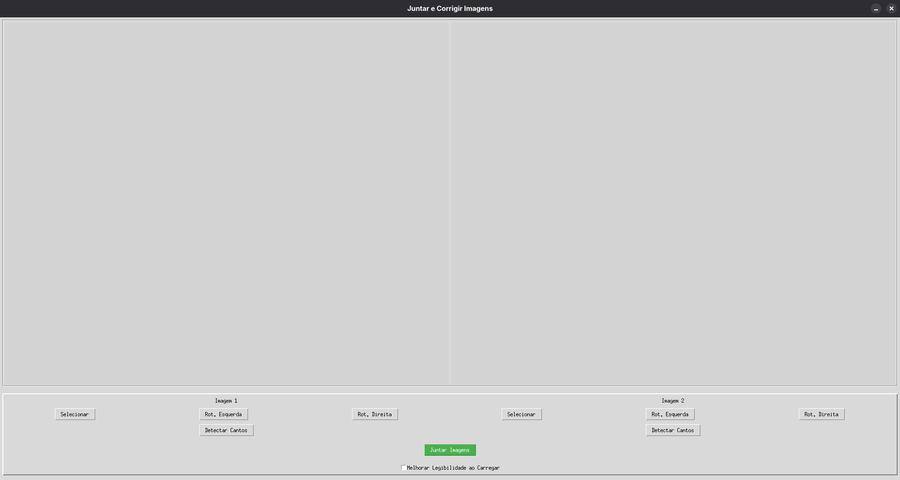

# 🖼️ Juntar Imagens de Documentos

Um programa simples em Python para unir imagens de documentos digitalizados em uma única imagem final. O software conta com funcionalidades automáticas para **detecção de bordas**, **ajuste de perspectiva**, e **melhorias de legibilidade**, facilitando a criação de documentos organizados e legíveis.

## ✨ Funcionalidades

- 📌 Junta múltiplas imagens (JPEG, PNG, etc.) em uma única imagem vertical.
- 🧠 Detecção automática de bordas usando OpenCV.
- 🛠️ Correções de perspectiva para melhorar o alinhamento do documento.
- 🌟 Melhoria da legibilidade com filtros e ajustes (contraste, nitidez, etc).
- 🖱️ Interface gráfica com Tkinter para facilitar a seleção e visualização.

## 📸 Captura de Tela



## 🧪 Tecnologias Usadas

- Python 3.x
- OpenCV
- Pillow
- NumPy
- Tkinter

## 🚀 Como Usar

### 1. Clone o repositório

```bash
git clone https://github.com/esdrasAraujo01/JuntarImagensDeDocumentos.git
cd JuntarImagensDeDocumentos
```

### 2. Instale as dependências

```bash
pip install -r requirements.txt
```

### 3. Execute o programa

```bash
python main.py
```

## ✅ Requisitos

- Python 3.10 ou superior
- Sistema operacional Linux ou Windows (testado no Fedora)

## 📂 Estrutura do Projeto

```
JuntarImagensDeDocumentos/
├── main.py                # Arquivo principal com a interface e lógica
├── utils/                 # Funções auxiliares (ex: melhorias e cortes)
├── assets/                # Ícones, imagens e outros recursos
├── README.md
└── requirements.txt       # Dependências do projeto
```

## 📃 Licença

Este projeto está licenciado sob a [Licença MIT](LICENSE).

## 👤 Autor

**Esdras De Araujo Silva**  
🔗 [GitHub](https://github.com/esdrasAraujo01)

---